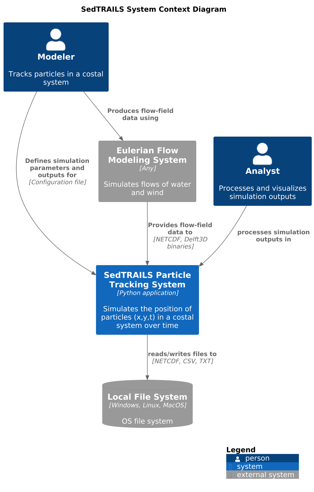
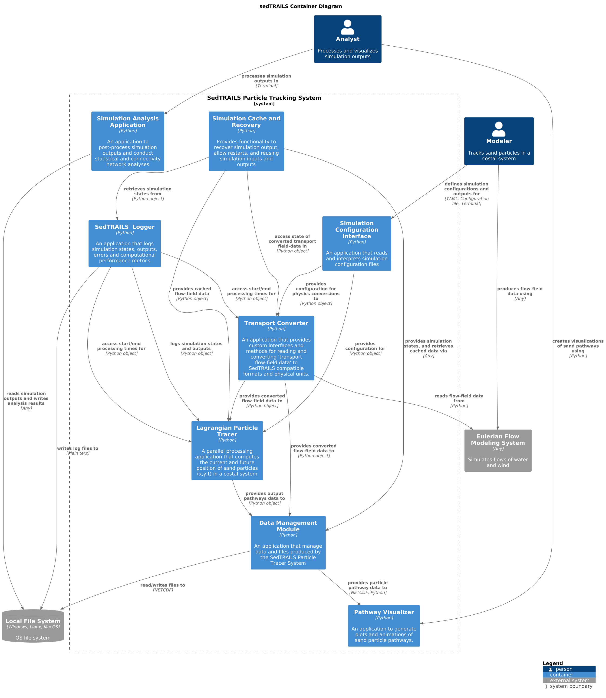
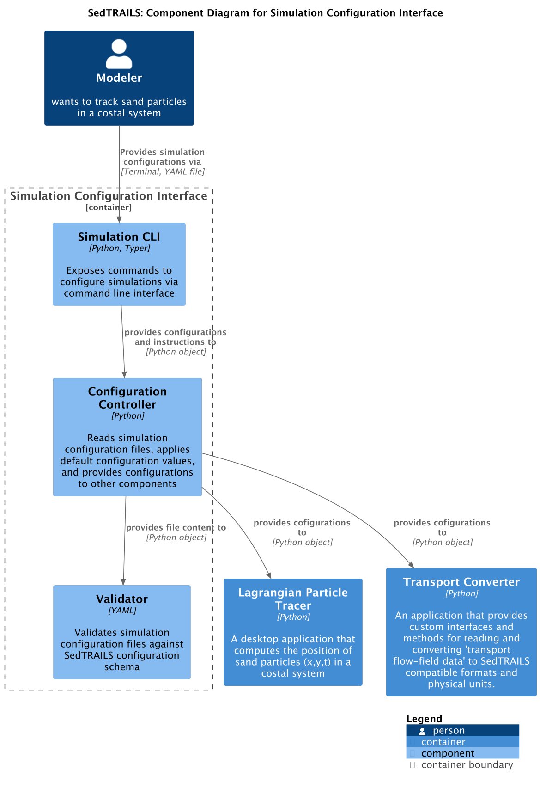
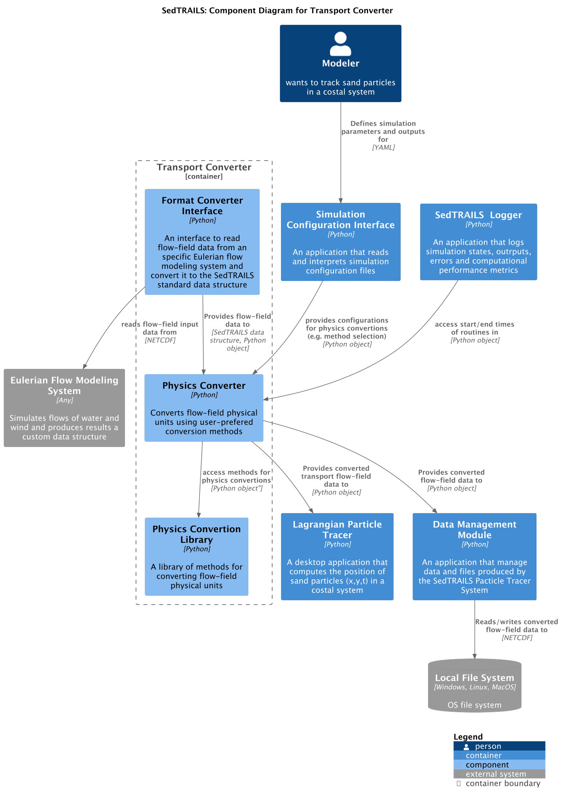
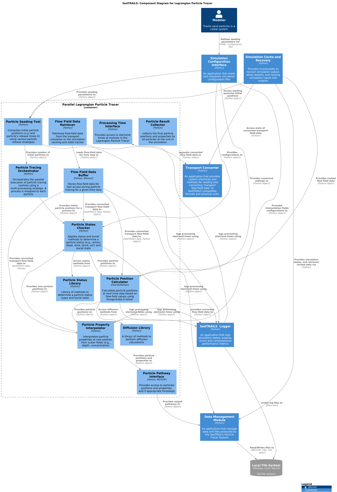
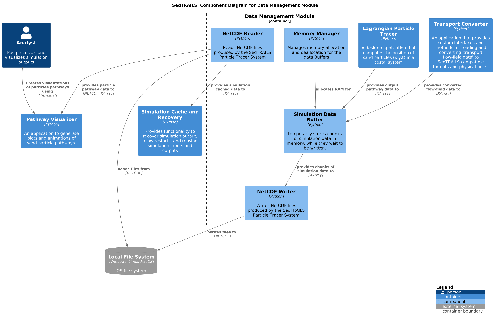
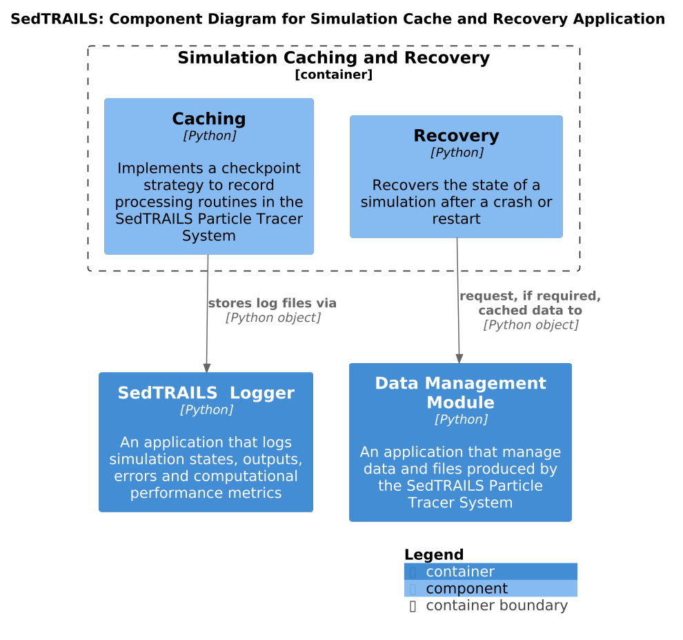

# Software Architecture

SedTRAILS was designed with a modular architecture to facilitate maintenance, scalability, and extensibility.
This document describes the software architecture of SedTRAILS (Sediment Transport and Lagrangian Simulator), a particle tracking system for coastal environments. The architecture follows the C4 model, presenting the system at multiple levels of detail from high-level context to detailed component diagrams.

## Table of Contents

1. [System Context](#system-context)
2. [Container View](#container-view)
3. [Component Details](#component-details)
   - [Application Interface](#application-interface)
   - [Simulation Orchestrator](#simulation-orchestrator)
   - [Transport Converter](#transport-converter)
   - [Lagrangian Particle Tracer](#lagrangian-particle-tracer)
   - [Data Management Module](#data-management-module)
   - [Simulation Analysis Application](#simulation-analysis-application)
   - [Simulation Cache and Recovery](#simulation-cache-and-recovery)

---

## System Context

The System Context diagram provides the highest-level view of SedTRAILS, showing how it fits within its environment and interacts with external systems and users.

### Key Elements

**Users:**
- **Modeler**: Defines simulation parameters and configures the system to track particle movement in coastal environments
- **Analyst**: Processes and visualizes simulation outputs for analysis and interpretation

**SedTRAILS System:**
- The core particle tracking system that simulates particle positions (x, y, z) in coastal environments over time
- Implemented as a Python application

**External Systems:**
- **Eulerian Flow Modeling System**: Provides flow field data (water and wind) from various modeling systems
- **Local File System**: Handles input/output operations for configuration files, flow data, and simulation results

The system reads flow field data in various formats (NetCDF, Delft3D binaries) and produces outputs in standard formats (NetCDF, CSV, TXT).

---

## Container View

The Container diagram shows the major applications and data stores that make up SedTRAILS, along with their relationships and communication patterns.

### Core Containers

#### 1. **SedTRAILS Application Interface**
A Python-based interface that provides access to SedTRAILS functionality through both CLI and programmatic APIs. Enables users to run simulations, visualize results, and analyze data.

#### 2. **Simulation Orchestrator**
Coordinates and manages the execution of simulation tasks, including initialization, time-stepping, and termination procedures. Acts as the central coordinator for all simulation activities.

#### 3. **Lagrangian Particle Tracer**
A parallel processing application that computes current and future positions of particles (x, y, t) in coastal systems. This is the computational core of SedTRAILS.

#### 4. **Transport Converter**
Provides custom interfaces and methods for reading and converting transport flow-field data to SedTRAILS-compatible formats and physical units. Supports multiple input formats through a plugin architecture.

#### 5. **Data Management Module**
Manages data and files produced by the particle tracer system, including reading/writing simulation results and handling cache files in NetCDF format.

#### 6. **Simulation Dashboard**
A GUI (Python/Qt) for visualizing simulation results in real-time during execution.

#### 7. **Pathway Visualizer**
Generates plots and animations of simulated particle pathways for post-processing analysis.

#### 8. **Simulation Analysis Application**
Provides tools for post-processing simulation outputs, conducting statistical analysis, and performing connectivity network analyses.

#### 9. **Simulation Cache and Recovery**
Handles simulation interruption recovery, allows restarts, and reuses simulation inputs/outputs to avoid redundant computations.

#### 10. **SedTRAILS Logger**
Logs simulation states, outputs, errors, and computational performance metrics.

### Data Flow

The containers communicate primarily through Python objects and data arrays. The Simulation Orchestrator acts as the central hub, coordinating between the particle tracer, transport converter, cache system, and data manager. Results flow from the particle tracer through the data manager to visualization and analysis tools.

---

## Component Details

### Application Interface

The Application Interface provides user access to SedTRAILS functionality through multiple channels.

**Components:**

1. **Command Line Interface (CLI)**
   - Built with Python and Typer
   - Exposes terminal commands for configuring and running simulations
   - Provides direct access to core functionality

2. **Application Interface (API)**
   - Python API exposing functions and classes for programmatic access
   - Enables configuration and execution of simulations through code
   - Provides access to visualization and analysis functionalities

3. **Configuration Controller**
   - Reads simulation configuration files (YAML)
   - Applies default values where needed
   - Distributes configuration to other components

4. **Validator**
   - Validates configuration files against SedTRAILS schema
   - Ensures configuration correctness before simulation execution

The CLI and Python API both interact with the Configuration Controller to manage simulation parameters, which are then passed to the Simulation Orchestrator for execution.

---

### Simulation Orchestrator

The Simulation Orchestrator manages the overall simulation workflow.

**Components:**

1. **Simulation Manager**
   - Manages overall simulation workflow
   - Handles initialization, time-stepping, and termination procedures
   - Coordinates between all simulation components

2. **Global Logger**
   - Central logging facility for the entire system
   - Captures simulation states, outputs, errors, and performance metrics
   - Writes entries to the SedTRAILS Logger

The orchestrator receives configurations from the Application Interface and coordinates the Transport Converter, Particle Tracer, Dashboard, and Cache systems to execute simulations.

---

### Transport Converter

The Transport Converter transforms flow field data from various Eulerian modeling systems into SedTRAILS-compatible formats.

**Components:**

1. **Format Converter**
   - Interprets flow-field data from specific Eulerian modeling systems
   - Converts data to SedTRAILS standard data structure
   - Supports multiple input formats through plugins

2. **Physics Converter**
   - Converts flow-field physical units
   - Applies user-preferred conversion methods
   - Interfaces with the Physics Conversion Library

3. **Physics Conversion Library**
   - Library of tracer methods for converting flow-field physical units
   - Includes methods like Soulsby, Van Westen, and Bertin formulations

4. **Flow Field Data Retriever**
   - Retrieves flow-field data in batches
   - Manages data conversions using batch processing strategy
   - Coordinates between file system and converters

5. **Flow Field Data Buffer**
   - Stores flow-field data in memory
   - Enables fast access during particle tracing
   - Optimized for current time step operations

The converter reads data from external flow modeling systems, processes it through format and physics conversions, and provides standardized data to the particle tracer.

---

### Lagrangian Particle Tracer

The Particle Tracer is the computational heart of SedTRAILS, calculating particle positions and states.

**Components:**

1. **Particle Seeder**
   - Creates simulation particles with initial positions (x, y)
   - Assigns particle release times (t)
   - Supports various seeding strategies

2. **Particle Tracing Orchestrator**
   - Manages parallel execution of particle tracing
   - Uses multi-processing strategy
   - Assigns processes to particle groups

3. **Timer**
   - Manages simulation and execution times
   - Provides time-stepping control
   - Coordinates temporal aspects of particle tracking

4. **Particle Position Calculator**
   - Implemented in Fortran/Python for performance
   - Calculates particle positions for each time step
   - Uses Runge-Kutta 4 solver
   - Incorporates flow-field values and diffusion

5. **Particle Status Calculator**
   - Determines particle status (active, dead, alive, stuck, etc.)
   - Calculates burial state for each time step
   - Uses status methods from the Status Library

6. **Particle Status Library**
   - Collection of methods for determining particle status types
   - Handles burial state calculations

7. **Particle Property Interpolator**
   - Interpolates particle properties at new positions
   - Works with scalar fields (depth, concentration, etc.)

8. **Diffusion Library**
   - Provides methods for diffusion calculations
   - Supports various diffusion models

The tracer orchestrates particle initialization through the seeder, manages time-stepping with the timer, and calculates positions and states using specialized calculators. Results are passed to the data manager for storage and analysis.

---

### Data Management Module

The Data Management Module handles all data I/O and temporary storage operations.

**Components:**

1. **NetCDF Reader**
   - Reads NetCDF files produced by SedTRAILS
   - Provides data to visualization and analysis tools
   - Supports cache data retrieval

2. **NetCDF Writer**
   - Writes simulation results to NetCDF format
   - Handles standardized output formatting

3. **Simulation Data Buffer**
   - Temporarily stores simulation data chunks in memory
   - Manages data waiting to be written to disk
   - Optimizes I/O operations

4. **Memory Manager**
   - Manages memory allocation and deallocation for buffers
   - Ensures efficient memory usage during simulation

The data manager receives particle pathway data from the tracer and converted flow-field data from the transport converter, buffers it in memory, and writes it to persistent storage. It also provides data access to visualization and analysis tools.

---

### Simulation Analysis Application

The Analysis Application provides post-processing capabilities for simulation outputs.

**Components:**

1. **NetCDF Reader**
   - Reads SedTRAILS simulation output files
   - Provides data to analysis modules

2. **Results Writer**
   - Writes analysis results to files
   - Supports various output formats

3. **Statistics Module**
   - Tools for statistical analysis of simulation data
   - Calculates relevant metrics and distributions

4. **Connectivity Network Module**
   - Tools for connectivity network analysis
   - Analyzes particle pathway networks

5. **Analysis Manager**
   - Coordinates analysis tasks
   - Manages data flow between components
   - Provides unified interface to application API

Users access analysis functionality through the Application Interface, which communicates with the Analysis Manager. The manager coordinates between the reader, analysis modules (statistics and connectivity), and the writer to produce analysis results.

---

### Simulation Cache and Recovery

The Cache and Recovery system enables simulation resilience and efficiency.

**Components:**

1. **Caching**
   - Implements checkpoint strategy
   - Records processing routines for recovery
   - Stores intermediate simulation states

2. **Recovery**
   - Recovers simulation state after crashes or restarts
   - Requests cached data from Data Manager when needed
   - Reads simulation checkpoints from log files

The cache system works closely with the SedTRAILS Logger to store checkpoints and with the Data Manager to cache and retrieve simulation data. This enables interruption recovery and restart capabilities, avoiding redundant computations.

---

## Architecture Principles

### 1. **Modularity**
The system is organized into distinct containers and components, each with clear responsibilities. This enables independent development, testing, and maintenance of different parts.

### 2. **Plugin Architecture**
The Transport Converter uses a plugin system for format and physics converters, allowing easy extension to support new data formats and transport formulations without modifying core code.

### 3. **Performance Optimization**
Critical computational components (Position Calculator) use Fortran for performance, while Python provides flexibility for orchestration and I/O operations. Parallel processing is employed for particle tracking.

### 4. **Configuration-Driven**
All simulation parameters are defined in YAML configuration files with schema validation, enabling reproducible simulations and easy parameter management.

### 5. **Data Flow Optimization**
Buffering strategies in both the Transport Converter and Data Manager optimize I/O operations and memory usage during large-scale simulations.

### 6. **Resilience**
The Cache and Recovery system provides checkpoint/restart capabilities, making the system resilient to interruptions and enabling efficient reruns.

---

## Technology Stack

- **Primary Language**: Python 3.10-3.13
- **GUI Framework**: Qt (Simulation Dashboard)
- **Data Formats**: NetCDF (primary), CSV, TXT
- **Configuration**: YAML with JSON schema validation
- **CLI Framework**: Typer
- **Parallel Processing**: Python multiprocessing
- **Scientific Computing**: NumPy, with Numba acceleration

---

## Deployment and Usage

SedTRAILS can be used in multiple ways:

1. **Command Line**: Using the CLI for batch simulations and analysis
2. **Python API**: Programmatic access for integration with other tools

The system integrates with various Eulerian flow modeling systems (Delft3D, FM NetCDF, etc.) and provides standardized outputs for analysis and visualization.
