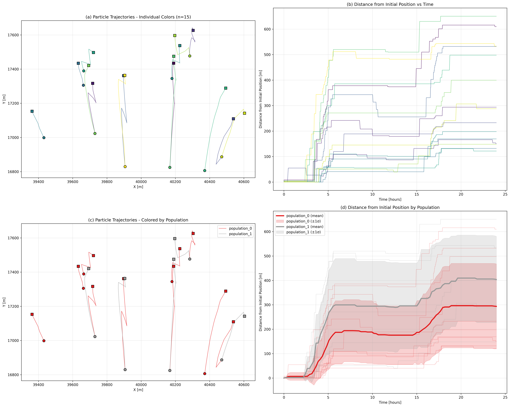

# Output

SedTRAILS writes run output to a NetCDF4 file named ``sedtrails_results.nc``. The file is streamed during the simulation and closed at the end of the run, so completed output samples are flushed to disk as the run progresses.

The output location is controlled by ``outputs.directory``. The default-like values ``./output``, ``output``, ``./results``, and ``results`` are resolved relative to the configuration file. Other paths are interpreted as normal file-system paths. The filename itself is currently fixed to ``sedtrails_results.nc``.

When ``outputs.store_tracks`` is enabled, the file contains time-varying trajectories and generally follows the spirit of [CF conventions for multidimensional arrays of trajectories](https://cfconventions.org/cf-conventions/v1.6.0/cf-conventions.html#_multidimensional_array_representation_of_trajectories). Trajectory samples are stored at the initial state, at each ``outputs.save_interval`` boundary, and at the final state when the simulation does not end exactly on a save boundary. The model may take shorter internal CFL timesteps between saved samples; those internal steps are not all written to the NetCDF file.

When ``outputs.store_end_positions`` is enabled, or ``outputs.store_tracks`` is disabled, SedTRAILS writes a compact result file with only one final state per particle and no ``n_timesteps`` dimension.

NetCDF compression is controlled by ``outputs.netcdf.compression``, which defaults to ``auto``. Set it to ``true`` or ``false`` to force a mode, or use ``auto`` to enable compression only when the estimated uncompressed particle payload reaches ``outputs.netcdf.compression_auto_threshold_mb``. The default threshold is ``1024`` MiB.

:::warning
The output file contains the core trajectory and timing metadata used by SedTRAILS tools, but variable-level CF metadata is still limited.
:::

## Output File Inspection

Use ``sedtrails inspect`` to view the dimensions, attributes, and variables in a results file:

```text
sedtrails inspect -f C:\your-filepath-here\sedtrails_results.nc
```

For a typical results file, the inspector output has this structure:

```text
Inspecting NetCDF file: C:\sedtrails\results\sedtrails_results.nc
====================================================================================
SEDTRAILS NETCDF FILE METADATA
====================================================================================
FILE: C:\sedtrails\results\sedtrails_results.nc
SIZE: 1.42 MB

GLOBAL ATTRIBUTES:
------------------------------------------------------------
  title: SedTRAILS Particle Simulation Results
  institution: SedTRAILS Particle Tracer System
  created_on: 2026-06-12T22:48:16.316000
  reference_date: 2016-09-21T00:00:00
  time_units: seconds since 2016-09-21T00:00:00
  time_start: 0s
  time_end_seconds_since_reference_date: 86400.0
  outputs_save_interval_seconds: 3600.0

DIMENSIONS:
------------------------------------------------------------
  n_particles: 15
  n_populations: 2
  n_timesteps: 25
  n_flowfields: 2
  name_strlen: 24

COORDINATES:
------------------------------------------------------------
  (none)

DATA VARIABLES:
------------------------------------------------------------
  population_name: ('n_populations', 'name_strlen') |S1 (2, 24)
  population_particle_type: ('n_populations',) int32 (2,)
  population_start_idx: ('n_populations',) int32 (2,)
  population_count: ('n_populations',) int32 (2,)
  population_repr_volume: ('n_populations',) float64 (2,)
  trajectory_id: ('n_particles', 'name_strlen') |S1 (15, 24)
  population_id: ('n_particles',) int32 (15,)
  flowfield_name: ('n_flowfields', 'name_strlen') |S1 (2, 24)
  time: ('n_particles', 'n_timesteps') float64 (15, 25)
  x: ('n_particles', 'n_timesteps') float64 (15, 25)
  y: ('n_particles', 'n_timesteps') float64 (15, 25)
  z: ('n_particles', 'n_timesteps') float64 (15, 25)
  burial_depth: ('n_particles', 'n_timesteps') float64 (15, 25)
  mixing_depth: ('n_particles', 'n_timesteps') float64 (15, 25)
  status_alive: ('n_particles', 'n_timesteps') int32 (15, 25)
  status_buried: ('n_particles', 'n_timesteps') int32 (15, 25)
  status_domain: ('n_particles', 'n_timesteps') int32 (15, 25)
  status_transported: ('n_particles', 'n_timesteps') int32 (15, 25)
  status_released: ('n_particles', 'n_timesteps') int32 (15, 25)
  status_mobile: ('n_particles', 'n_timesteps') int32 (15, 25)
  status_beached: ('n_particles', 'n_timesteps') int32 (15, 25)
  status_left_domain: ('n_particles', 'n_timesteps') int32 (15, 25)
  covered_distance: ('n_flowfields', 'n_particles', 'n_timesteps') float64 (2, 15, 25)

====================================================================================
```

Exact sizes depend on the run duration, save interval, number of populations, number of particles, and transport methods used by those populations.

## Details of Output File Contents

### Global Attributes

Global attributes describe the file and the timing convention used by the run.

- ``title``: Identifies the file as SedTRAILS particle simulation output.
- ``institution``: Identifies the producing system.
- ``created_on``: Wall-clock creation time of the NetCDF file.
- ``reference_date``: Reference date used by the run's input model.
- ``time_units``: Unit convention for the numeric values in the ``time`` variable.
- ``time_start``: Configured simulation start value.
- ``time_end_seconds_since_reference_date``: Simulation end time in seconds relative to ``reference_date``.
- ``outputs_save_interval_seconds``: Output sampling interval in seconds.

### Dimensions

Dimensions define the axes used by the data variables.

- ``n_particles``: Total number of particles across all populations.
- ``n_populations``: Number of particle populations in the configuration.
- ``n_timesteps``: Number of saved output slots. This is not the number of internal CFL timesteps.
- ``n_flowfields``: Number of transport flow fields recorded in the output metadata. If no flow-field names are available, the writer still creates one flow-field slot.
- ``name_strlen``: Fixed string length used for character-array variables such as ``population_name`` and ``trajectory_id``.

### Coordinates

The current streaming writer creates dimensions but does not create separate coordinate variables for those dimensions. As a result, the ``COORDINATES`` section can be empty even though the dimensions are valid. Consumers should use zero-based positional indices for ``n_particles``, ``n_populations``, ``n_timesteps``, ``n_flowfields``, and ``name_strlen`` when needed.

### Data Variables

The main output variables are:

- ``population_name``: Fixed-width character array containing the configured population names.
- ``population_particle_type``: Numeric particle-type code stored by the runtime population object. Use ``population_name`` and the original configuration for the human-readable particle type when needed.
- ``population_start_idx``: Start index of each population in the combined particle axis.
- ``population_count``: Number of particles in each population.
- ``population_repr_volume``: Representative volume for each population when available; otherwise ``NaN``.
- ``trajectory_id``: Fixed-width generated trajectory identifiers, such as ``traj_0``.
- ``population_id``: Population index for each particle along the combined particle axis.
- ``flowfield_name``: Names of the transport flow fields used by the runtime tracer plans, such as ``bed_load_velocity`` or ``suspended_velocity``.
- ``time``: Numeric simulation time for each particle and saved output slot, following the global ``time_units`` attribute.
- ``x``, ``y``, ``z``: Particle coordinates at each saved output slot.
- ``burial_depth``: Particle burial depth at each saved output slot.
- ``mixing_depth``: Local mixing-layer depth sampled for each particle at each saved output slot, when available.
- ``status_alive``: ``1`` for particles still active in the simulation, ``0`` for particles removed from consideration.
- ``status_buried``: ``1`` for particles considered buried and therefore not mobile, ``0`` for particles considered exposed.
- ``status_domain``: ``1`` for particles inside the active particle-tracking mesh, ``0`` for particles outside it. The active mesh excludes holes created by ``domain.inner_boundary_pol_files``.
- ``status_transported``: ``1`` for particles selected for transport during the current update, ``0`` for particles not selected for transport.
- ``status_released``: ``1`` for particles whose release time has passed, ``0`` for particles waiting for release.
- ``status_mobile``: ``1`` only when all mobility gates pass: in domain, alive, exposed, released, and selected for transport.
- ``status_beached``: ``1`` for particles that touched or crossed a boundary edge classified as ``land`` during that timestep. Beached particles remain at their last valid in-domain position and can become mobile again later.
- ``status_left_domain``: ``1`` for particles that crossed a boundary edge classified as ``open``. This state is persistent; those particles are marked not alive and are removed from subsequent movement calculations.
- ``covered_distance``: Reserved for per-flow-field distance accounting. The current streaming writer creates this variable for schema compatibility but does not populate it, so values remain ``NaN``.

Floating-point variables use ``NaN`` for missing or unwritten values. Integer status variables use ``-1`` for unwritten slots. Written status values are stored as ``0`` or ``1``.

## Output Visualization

Use ``sedtrails viz trajectories`` to plot the saved ``x``, ``y``, and ``time`` trajectories:

```text
sedtrails viz trajectories -f C:\your-filepath-here\sedtrails_results.nc
```

By default, the command draws only the spatial trajectory panel so it remains usable for large particle sets. Write directly to a file and plot a deterministic sample for the fastest workflow:

```text
sedtrails viz trajectories -f C:\your-filepath-here\sedtrails_results.nc --output trajectories.png --max-particles 2000 --markers end
```

Use ``--panels all`` to draw the previous four-panel summary, or request selected optional panels:

```text
sedtrails viz trajectories -f C:\your-filepath-here\sedtrails_results.nc --panels spatial,population --output trajectories.png
```



The built-in trajectory plotter reads the saved particle coordinates directly. Its distance panel is computed from each particle's saved ``x`` and ``y`` positions relative to that particle's first valid position; it does not use ``covered_distance``.

The following options can be used to save and customize the plot:

- ``--file`` or ``-f``: Path to the SedTRAILS NetCDF file to visualize. By default, it expects ``sedtrails_results.nc`` in the current directory.
- ``--output``: Exact plot file path to write. When used, the plot is saved directly and no figure window is opened by default.
- ``--save`` or ``-s``: Save the figure as ``particle_trajectories.png``.
- ``--output-dir`` or ``-o``: Directory for the saved PNG when ``--save`` is used. The default is the current directory.
- ``--max-particles``: Maximum number of particles to plot. The sample is deterministic and stratified by population where population IDs are available.
- ``--sample-fraction``: Fraction of particles to plot. This cannot be combined with ``--max-particles``.
- ``--sample-seed``: Seed for deterministic sampling. The default is ``0``.
- ``--markers``: Endpoint markers to draw: ``none``, ``end``, or ``start-end``. The default is ``end``.
- ``--marker-size``: Marker size for start/end points. The default is ``3``.
- ``--panels``: Panels to draw. The default is ``spatial``. Use ``all`` for the previous four-panel plot, or a comma-separated subset of ``spatial``, ``distance``, ``population``, and ``population-distance``.
- ``--show`` or ``--no-show``: Override whether an interactive figure window is displayed. By default, saved plots are not shown and unsaved plots are shown.
- ``--help`` or ``-h``: Show the command help.

:::warning
More advanced visualization functions will be added in future releases, but for now we encourage users to build custom visualizations directly from the output data.
:::
