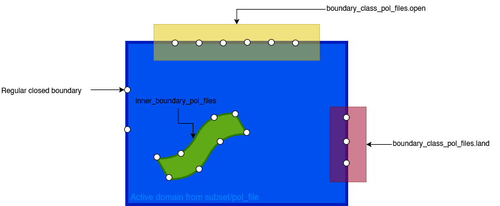

# Simulations

::: warning
Explain how a user configures and runs a simulation
Outputs are explained in a separate section
:::

## Configuring a Simulation

Simulations are configured using YAML files. These files define the parameters and settings for running SedTRAILS simulations, including input data, particle properties, and output options.

For a detailed reference of all available parameters, please refer to the [Simulation Parameters Reference](../references/simulation-params.md).

`seeding.release_start` is interpreted relative to `general.input_model.reference_date`.
For example, if `reference_date` is `2016-09-21 19:20:00` and `release_start` is `2016-09-21 19:30:00`, particles are released 600 seconds after simulation start.

The `domain` section is optional. If you do not need a custom extent, island/cutout masking, or open/land boundary overrides, omit `domain` entirely and SedTRAILS uses the active grid from the input model. If a `domain` section is present, it must define the active extent with exactly one method: either `domain.pol_file` or both `domain.subset_x` and `domain.subset_y`.

For FM and SFINCS models, the optional `domain.inner_boundary_pol_files` setting can use Tekal polygons to mask islands/cutouts. For FM, SFINCS, and XBeach models, `domain.boundary_class_pol_files` can classify boundary crossings as `open` or `land`. These settings modify the active extent; they do not define an extent by themselves. Boundary-class polygons select active boundary edges by edge midpoint. Drawing rule: boundary-class polygons may be wider than a thin line as long as they only contain the intended edge midpoints, and do not include neighboring or unrelated boundary-edge midpoints. See the domain section of the parameter reference for the full behavior.



This conceptual schematic shows the roles of the different polygon settings. The outer polygon or rectangular subset defines the active extent, inner-boundary polygons remove cutouts, and boundary-class polygons classify active boundary edges by midpoint.

The "regular closed boundary" is defined by the edge of the "active domain", and comes from:
-	the input model grid, if domain is omitted
-	the clipped/masked domain from `domain.pol_file`, if supplied
-	the rectangular clipped domain from `subset_x` + `subset_y`, if supplied
plus any holes/cutouts created by `inner_boundary_pol_files`

After that is settled, the `boundary_class_pol_files.open` and `.land` only override parts of that active boundary by testing boundary-edge midpoints, and set the particle behaviour according to that.


### Example Configuration File

```yaml

general:
  input_model: 
    format: fm_netcdf
    reference_date: 1970-01-01  # Default reference date for the input model
    morfac: 1  # Morphological acceleration factor for time decompression
    coordinate_system: auto  # Use geographic for lon/lat files without coordinate attrs
    source_crs: EPSG:4326
    metric_crs: auto_utm
inputs:
  data: ./sample-data/inlet_sedtrails.nc
  read_interval: 10D  # Time chunk size for reading input data
  max_eulerian_memory_mb: 2048  # Bound time-varying input fields per window
# Optional domain controls for islands/cutouts and boundary actions.
# Tekal .pol paths are resolved relative to this configuration file.
# Omit domain entirely if no custom extent, cutouts, or boundary overrides are needed.
# If domain is present, use either pol_file or subset_x/subset_y to define the extent.
# Boundary-class polygons classify edge midpoints; they need not be thin lines,
# but should not include unintended neighboring edge midpoints.
# domain:
#   pol_file: ./outer_domain.pol
#   inner_boundary_pol_files:
#     - ./islands.pol
#   boundary_class_pol_files:
#     open:
#       - ./offshore_boundary_edges.pol
#     land:
#       - ./coastline_boundary_edges.pol
time:
  start:  2016-09-21 19:20:00
  timestep: 60S
  duration: 1D
  cfl_condition: 0.7  # CFL condition for adaptive timestep (0 = disabled)
particles:
  populations:
    - name: population_1
      particle_type: sand
      characteristics:
        grain_size: 0.00025 
        density: 2650.0  
      tracer_methods:
        vanwesten:
          flow_field_name: 
            - bed_load_velocity
            - suspended_velocity
      transport_probability: stochastic_transport  # Options: no_probability, stochastic_transport, reduced_velocity
      seeding:
        burial_depth: 
          constant: 0
        release_start: 2016-09-21 19:30:00
        quantity: 1
        strategy: 
          random:
            bbox: "39400,16800 40600,17800"
            seed: 42
            nlocations: 10
    - name: population_2
      particle_type: sand
      characteristics:
        grain_size: 0.00035 
        density: 2650.0  
      tracer_methods:
        vanwesten:
          flow_field_name: 
            - bed_load_velocity
            - suspended_velocity
      transport_probability: stochastic_transport  # Options: no_probability, stochastic_transport, reduced_velocity
      seeding:
        burial_depth: 
          constant: 0
        release_start: 2016-09-21 19:30:00
        quantity: 1
        strategy: 
          random:
            bbox: "39400,16800 40600,17800"
            seed: 42
            nlocations: 5
outputs:
  directory: ./results
  store_tracks: true
  save_interval: 1H
visualization:
  dashboard:
    enable: true
    update_interval: 1H
```

### Choosing a Tracer Mode

Each population must define exactly one tracer method under `particles.populations[].tracer_methods`.

- There is **no default tracer method**. You must explicitly choose one of: `vanwesten`, `soulsby`, or `passive_tracer`.
- For `passive_tracer`, `flow_field_name` is optional and defaults to `depth_avg_flow_velocity`.
- For `vanwesten` and `soulsby`, you should provide `flow_field_name` explicitly.
- If you use `passive_tracer`, set `particle_type: passive`.
- If you use `passive_tracer`, `transport_probability` must be `no_probability` (the default). Using `stochastic_transport` or `reduced_velocity` raises a configuration error.
- If you use `passive_tracer`, omit `seeding.burial_depth`. Passive tracer does not support burial depth and will raise a configuration error if it is set.

Use the following minimal keyword blocks inside each population:

```yaml
tracer_methods:
  vanwesten:
    flow_field_name:
      - bed_load_velocity
      - suspended_velocity
```

```yaml
tracer_methods:
  soulsby:
    flow_field_name:
      - grain_velocity
```

```yaml
tracer_methods:
  passive_tracer: {}
```

Minimal passive population example:

```yaml
- name: passive_population
  particle_type: passive
  characteristics:
    diffusion_coefficient: 0.0
  tracer_methods:
    passive_tracer: {}
  seeding:
    release_start: 2016-09-21 19:30:00
    quantity: 1
    strategy:
      random:
        bbox: "39400,16800 40600,17800"
        seed: 42
        nlocations: 10
```

You can also set an explicit passive flow field:

```yaml
tracer_methods:
  passive_tracer:
    flow_field_name:
      - depth_avg_flow_velocity
```

Repository examples by mode:

- Van Westen: `examples/sedtrails-example.yaml`
- Soulsby: `examples/config.example_soulsby.yaml`
- Passive tracer: `examples/sedtrails-example-passive.yaml` (FM) and `examples/config.example_sfincs.yaml` (SFINCS)

Run any mode the same way by selecting the config file:

```bash
sedtrails run -c ./examples/sedtrails-example.yaml
sedtrails run -c ./examples/config.example_soulsby.yaml
sedtrails run -c ./examples/config.example_sfincs.yaml
```

## Running a Simulation

The following steps run the tracked example configuration at `examples/sedtrails-example.yaml`.

:::important
Make sure you have SedTRAILS installed. If you haven't installed it yet, please refer to the [Installation Guide](./installation.md).

The example configuration is part of the repository under `examples/sedtrails-example.yaml`.
:::

1. Download the dataset file named `inlet_sedtrails.nc` from [this link](https://surfdrive.surf.nl/files/index.php/s/VUGKZm7QexAXuD9?path=%2Fdfm).

2. From the repository root, create a `sample-data` directory and save the downloaded file there.

```bash
mkdir -p sample-data
```

3. In `examples/sedtrails-example.yaml`, set `inputs.data` to the downloaded file.

```yaml
inputs:
  data: ./sample-data/inlet_sedtrails.nc
```

4. Run the model using the following command:

```bash
sedtrails run -c ./examples/sedtrails-example.yaml
```

::: note
The simulation will start running, and a dashboard will open if it is enabled in the configuration. Output is written to `examples/results/sedtrails_results.nc` unless you change `outputs.directory`.
:::

## Restarting a Simulation

If a simulation is interrupted or needs to continue from a specific point, you can generate a restart configuration that uses the last valid particle positions from a previous run as seed points for a new simulation.

### When to Use Restart

The restart feature is useful when:
- A long simulation crashes or is stopped before completion
- You want to continue a simulation without losing progress
- You need to extend a finished simulation with additional runtime
- You want to restart from intermediate results to test different transport parameters

### Prerequisites

To restart a simulation, you need:
1. A NetCDF output file from a previous SedTRAILS run (e.g., `sedtrails_results.nc`)
2. The original simulation configuration file used to generate that output
3. Both files must be accessible from your working directory

### Generating a Restart Configuration

The restart process automatically:
- Extracts the **last valid particle position** for each particle in the NetCDF output
- Filters particles to include only those that were alive and in-domain at their last position
- **Computes remaining runtime** based on the original simulation duration and elapsed time (see "Edge Case - Full Completion" in [Notes and Tips](#notes-and-tips))
- Generates per-population seed point CSV files
- Creates a new YAML configuration file ready to run

#### Command Syntax

```bash
sedtrails config restart -f <results_file> -c <base_config> -o <output_config> [--seed-dir <seed_directory>]
```

**Parameters:**
- `-f, --file`: Path to the NetCDF results file from the previous run (default: `sedtrails_results.nc`)
- `-c, --config`: Path to the original YAML configuration file (default: `sedtrails.yml`)
- `-o, --output`: Path where the new restart YAML will be written (default: `sedtrails-restart.yaml`)
- `--seed-dir`: (Optional) Custom directory for generated seed point CSV files. If not specified, defaults to `<output_config_directory>/<output_config_stem>_seeds/`

#### Example: Basic Restart

If your previous run output is in `./results/sedtrails_results.nc` and the config was `./examples/sedtrails-example.yaml`:

```bash
sedtrails config restart -f ./results/sedtrails_results.nc \
                        -c ./examples/sedtrails-example.yaml \
                        -o ./examples/restart.yaml
```

This command will:
1. Read the last valid position of each particle from `sedtrails_results.nc`
2. Calculate the elapsed time and remaining duration from the original run
3. Generate seed point files in `./examples/restart_seeds/` (one CSV per population)
4. Create `./examples/restart.yaml` with:
   - Updated `time.start` set to when the restart will begin
   - Adjusted `time.duration` set to the remaining time from the original run
   - Each population's seeding strategy replaced with `file_points` referencing the generated CSV files

#### Example Output

The generated restart YAML will look similar to this:

```yaml
general:
  input_model:
    format: fm_netcdf
    reference_date: '1970-01-01'
    morfac: 1
    coordinate_system: auto
    source_crs: EPSG:4326
    metric_crs: auto_utm
inputs:
  data: ./sample-data/inlet_sedtrails.nc
time:
  start: '2016-09-27 03:22:48'          # Updated to last valid timestamp
  timestep: 60S
  duration: 4D15H57M12S                 # Adjusted to remaining time from original 10D run
particles:
  populations:
  - name: population_1
    particle_type: sand
    seeding:
      strategy:
        file_points:
          path: ./examples/restart_seeds/population_1.restart_points.csv
          x_col: x
          y_col: y
          has_header: true
```

The seed point CSV files contain particle coordinates from the last valid timestep:

```text
x,y
40293.54196405,17547.72446346
39626.62407569,17560.15080805
40360.98655363,17704.94651676
```

### Running the Restart

Once the restart configuration is generated, run it like any other simulation:

```bash
sedtrails run -c ./examples/restart.yaml
```

The new simulation will:
- Start from the particle positions saved in the seed point files
- Use the adjusted `time.duration` to simulate only the remaining time
- Output results to the same or a different output directory (configured in the restart YAML)

(notes-and-tips)=
### Notes and Tips

- **Particle Retention**: Only particles that were alive and within the domain at their last position are included in the restart. Particles that escaped the domain or were trapped will not be restarted.

- **Reference Date Handling**: If your original configuration used `general.input_model.reference_date`, the restart YAML preserves that reference date and computes `time.start` from output times using the same time origin. Newer output files can also provide explicit `reference_date` or `time_units` metadata.

- **Forcing Window Validation**: A generated restart must start inside the original input forcing window. If the output time would create a restart such as `1970-01-01 04:16:40` for forcing that starts in 2016, restart generation raises an error instead of writing an invalid YAML.

- **Relative Paths**: Generated seed file paths in the restart YAML are relative to the current working directory (using `./` prefix). Make sure to run the restart from the same directory where the YAML was generated, or update the paths accordingly.

- **Duration Precision**: The remaining duration is calculated to second precision and formatted in SedTRAILS duration syntax (e.g., `4D15H57M12S` = 4 days, 15 hours, 57 minutes, 12 seconds).

- **Edge Case - Full Completion**: If the output file shows that the original simulation ran to completion (all particles reached the end time), the restart will report "No remaining duration left" and decline to create a restart file.

